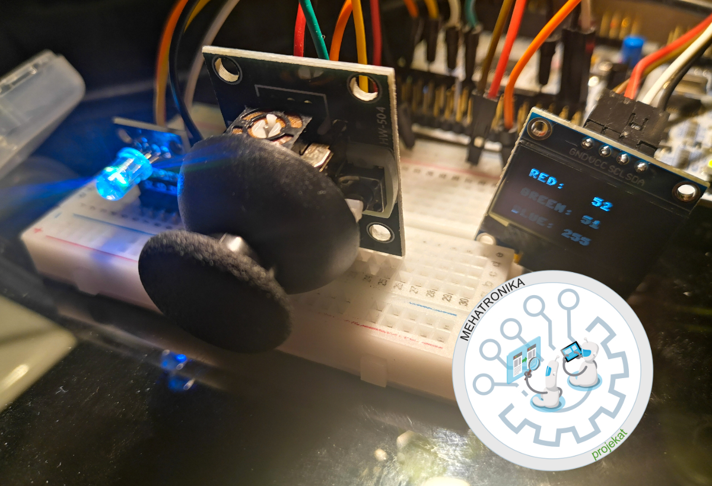
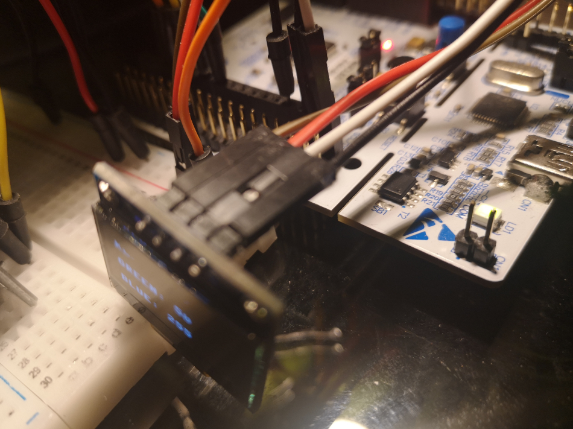
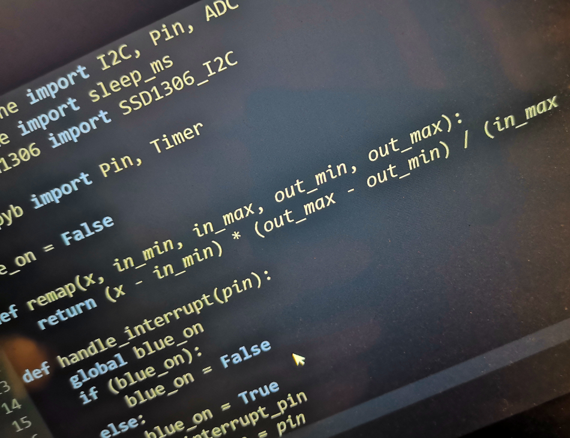
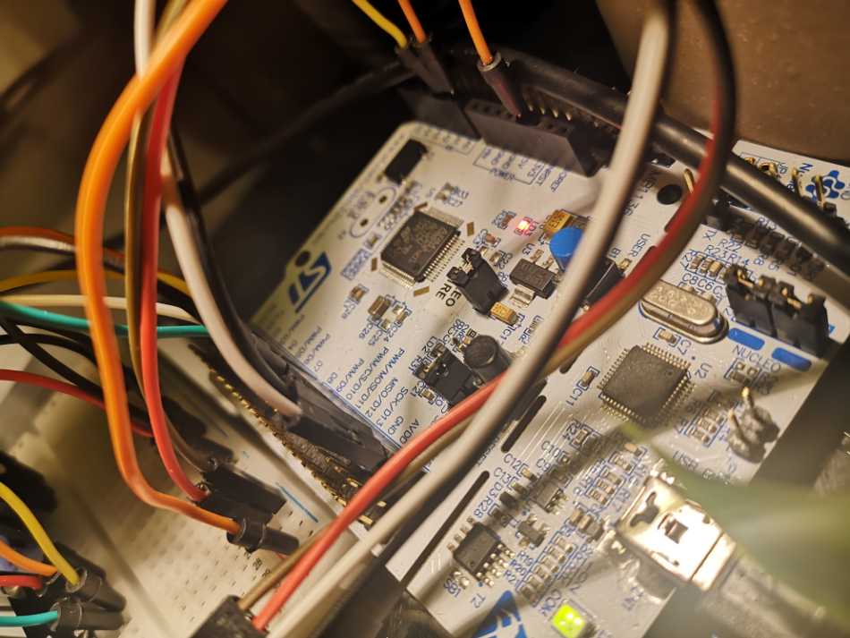

# Nucleo64-STM32F401RE-micropython-demo
Nucleo64 STM32F401RE micropython demo - OLED SSD1306 I2C

sh1107.py treba preuzeti sa: https://github.com/stlehmann/micropython-ssd1306/blob/master/ssd1306.py

# ssd1306 -> STM32F401RE
SCL -> SCL/D15
SDA -> SDA/D14

# RGB dioda -> STM32F401RE
R -> D3/PWM
G -> D5/PWM
B -> D7

# HW-504 Joystick
VRx -> A0 
VRy -> A1
SW -> D8

